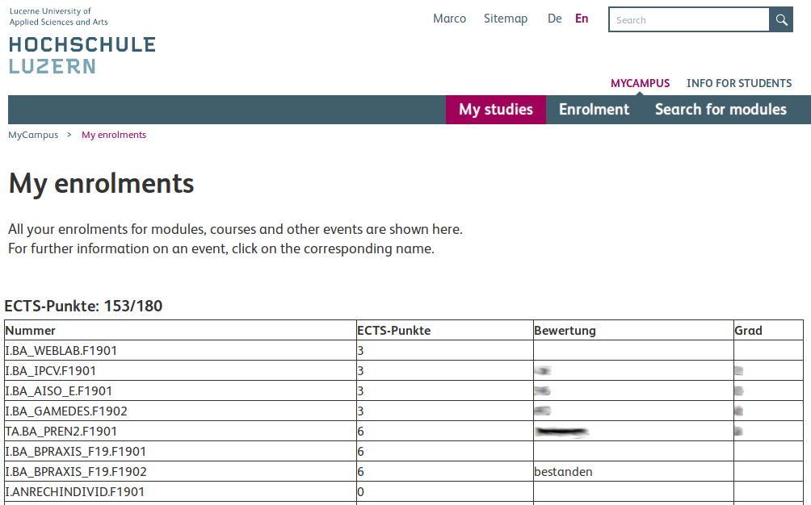

    
  
  
  

  
  

# HSLU simple MEP results
This browser add-on extends the page ['Meine Anmeldungen'](https://mycampus.hslu.ch/de-ch/stud-i/mein-studium/meine-anmeldungen/) on the HSLU MyCampus website.

# Contributors

This project is maintained by [@Lextum](https://github.com/Lextum) and [@eddex](https://github.com/eddex).

Thanks to everyone who contributed to this project in the form of code or reporting issues!

Want to add some missing modules, fix a bug or add a new, awesome feature? That's great. But please read [CONTRIBUTING.md](CONTRIBUTING.md) first!

# Features

The browser add-on extends the page with the following features:
- A simple table with all your modules, credits and grades
- An overview of how many modules of each type have been done / are still needed.
- An overview of your grades including grade distribution and average.
- A chart to visualize your credit progress.

# Installation

You only have to install the extension once. After this you'll get automatic updates!

## Firefox

**Releases** (recommended)

- Download the `.xpi` file from the [latest release](https://github.com/eddex/hslu-simple-mep-results/releases)
- Firefox should prompt you to install the extension, if not..
  - Open Firefox and open the URL `about:addons`
  - Press the gear-button and select *Install Add-on from File...*
  - Select the downloaded `.xpi` file

**From sources**
- Clone / download this repo (and unzip it)
- Open `about:debugging`
- On the Add-ons tab click `<Load Temporary Add-on..>`
- Select any file in the downloaded folder
- Open https://mycampus.hslu.ch/de-ch/stud-i/mein-studium/meine-anmeldungen/

## Chrome

**Releases** (recommended)
- Install the extension from the [chrome web store
](https://chrome.google.com/webstore/detail/hslu-simple-mep-results/bkcgbpgefenaapagldnnabfakilmfihp)

Google might remove the extension from the store again, so stay tuned.

**From sources**

- Clone / download this repo (and unzip it)
- Open `chrome://extensions/`
- Enable developer mode
- Click `<Load unpacked>`
- Select the downloaded folder of this repo
- Open https://mycampus.hslu.ch/de-ch/stud-i/mein-studium/meine-anmeldungen/

# Development

## Create a new release

1. Update the version number in `src/manifest.json`.
2. Add everything from `src/` to a `.zip` file:
  - `_locales/` directory
  - `components/` directory
  - `data/` directory
  - `icons/` directory
  - `lib/` directory
  - `popup/` directory
  - `templates/` directory
  - `LICENSE` file
  - `main.js` file
  - `manifest.json` file
3. Update Firefox Release
  - Login to https://addons.mozilla.org/en-US/developers/
  - HSLU simple MEP results > Edit product page > Upload new version.
  - Download the generated `.xpi` file.
  - Change the end of the filename form `-fx.xpi` to `-firefox.xpi`.
  - Update `updates.json` with the new release.
    - To get the `update_hash` generate the sha256 hash of the file.
    - e.g. `Get-FileHash hslu_simple_mep_results-2.0.8-firefox.xpi` in PowerShell.
  - Create a branch (e.g. `release/2.0.15`), push your changes and create a pull request.
4. Update Chrome Release
- Login to https://chrome.google.com/webstore/devconsole
- Items > HSLU simple MEP results > Package > Upload new package
- Update anything that's need updating
- Save the changes and klick publish
5. AFTER(!) the pull request is merged, create a new release in this repo and attach the `.xpi` file.